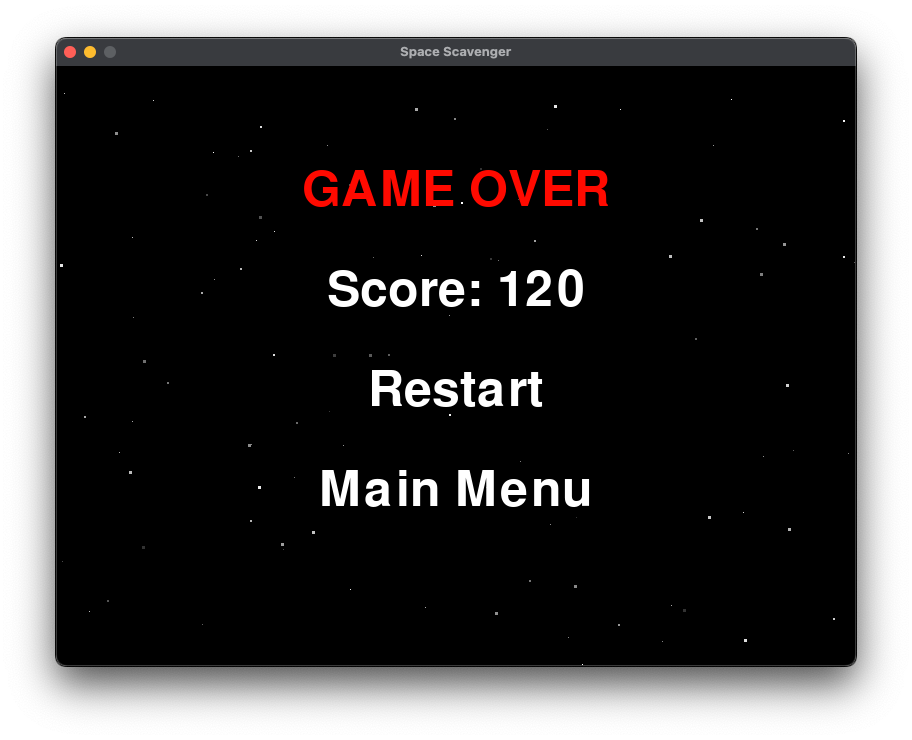

# Space Scavenger 
## 211557 - Sebastijan Zindl

## How to Play
The game is played by using the "W,A,S,D" keys which moves the player around a dangerous asterioid
field. The goal is to collect as much energy crystals as you can so you can match the score of the level, while 
dodging all incoming asteroids at you. 

### Scoring
- Each energy crystal collected increases the score by a fixed amount.
- The required score to win varies by difficulty level.

### Game Over
- Colliding with an asteroid results in an instant game over.
- The player must avoid all asteroids while collecting crystals to stay in the game.

### Winning
- The player wins by matching or exceeding the score required for the current level. The game then transitions to the `WIN` state.

---

## Implementation Details

### Difficulty Levels
The game has three difficulty levels:
- **EASY**
- **MEDIUM**
- **HARD**

### Game States
The game uses the following states to manage transitions:
- **MENU**: Displays the main menu.
- **DIFFICULTY**: Allows the player to select a difficulty level.
- **PLAYING**: Runs the main game loop.
- **LOSE**: Displays the game over screen.
- **WIN**: Displays the victory screen.

### Core Classes and Methods
- **`Game` Class**:
    - The main class that initializes all assets, variables, and game logic.
    - Handles state transitions using the `GameState` enum.
- **`handle_playing` Method**:
    - Processes player input and moves the player based on the key pressed.
    - Spawns asteroids and crystals.
    - Checks for collisions between the player and objects.
    - Removes objects that leave the screen.

---

## Features

### Asteroids
- Asteroids increase in size gradually over 60 seconds until they reach `MAX_ASTEROID_SIZE`.
- The scaling is automated and tied to a timer.

### Stars
- A dynamic star system creates a parallax effect for the background.
- The `Star` class and `draw_stars` method handle the rendering of stars in each frame.

---

## Screenshots

